# Architecture Diagrams

Professional architecture diagrams for the HA Custom Dashboard project.

**Note:** These diagrams are written in Mermaid and render automatically on GitHub, VS Code (with Mermaid extension), and many markdown viewers.

---

## System Architecture Overview

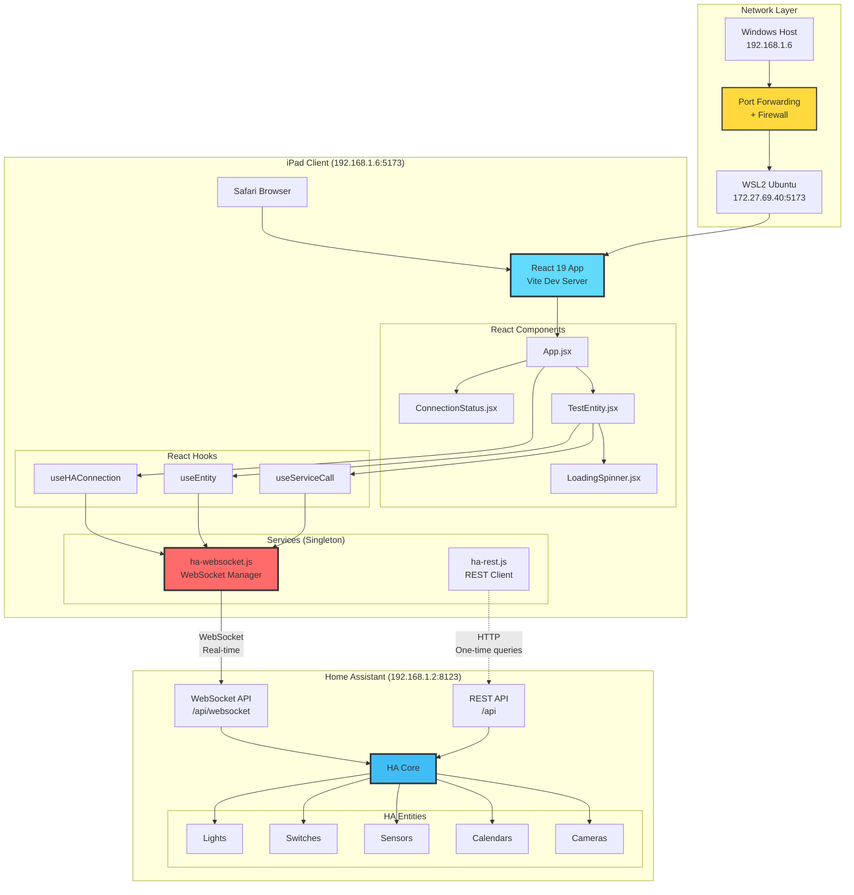

---

## WebSocket Connection Flow

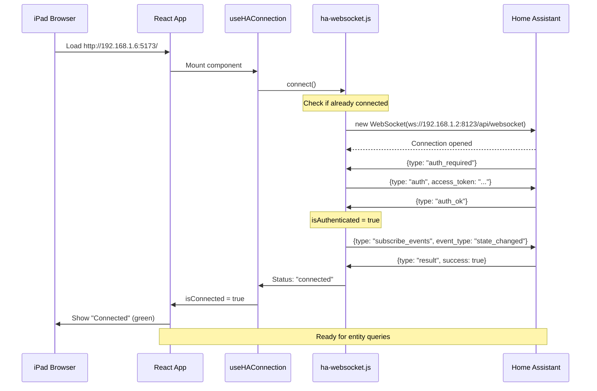

---

## Entity State Update Flow

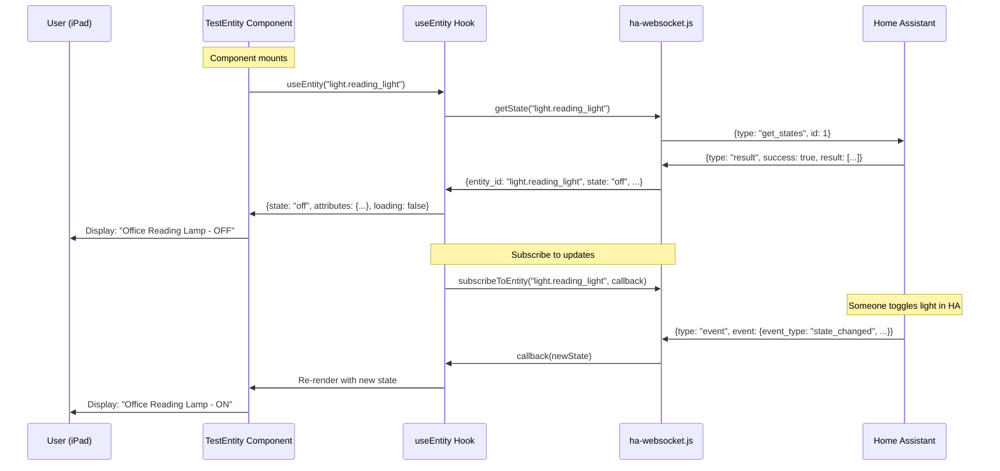

---

## Service Call Flow (Toggle Light)

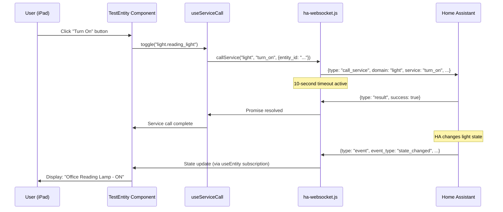

---

## React Component Hierarchy

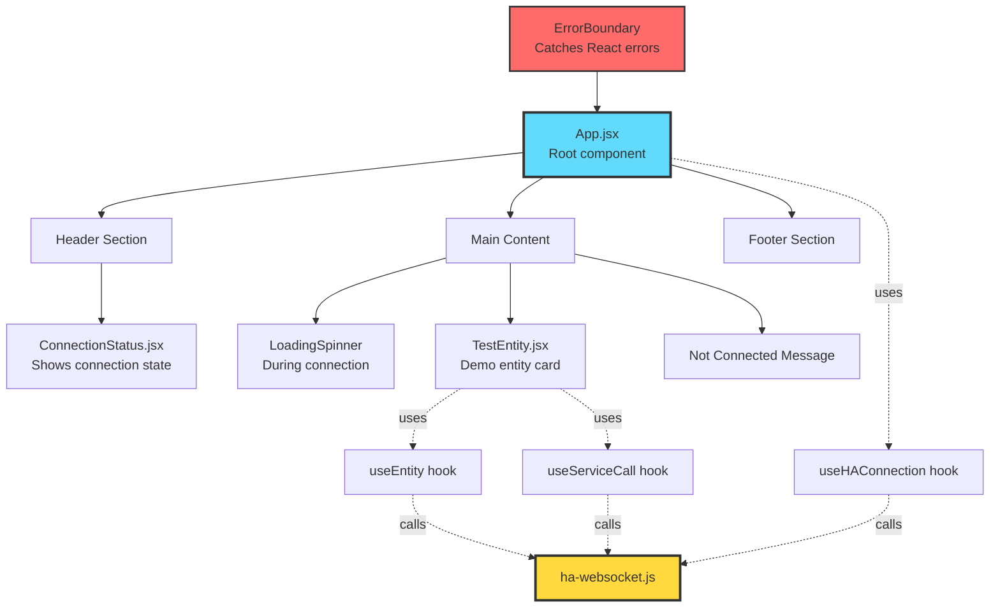

---

## Hook State Management

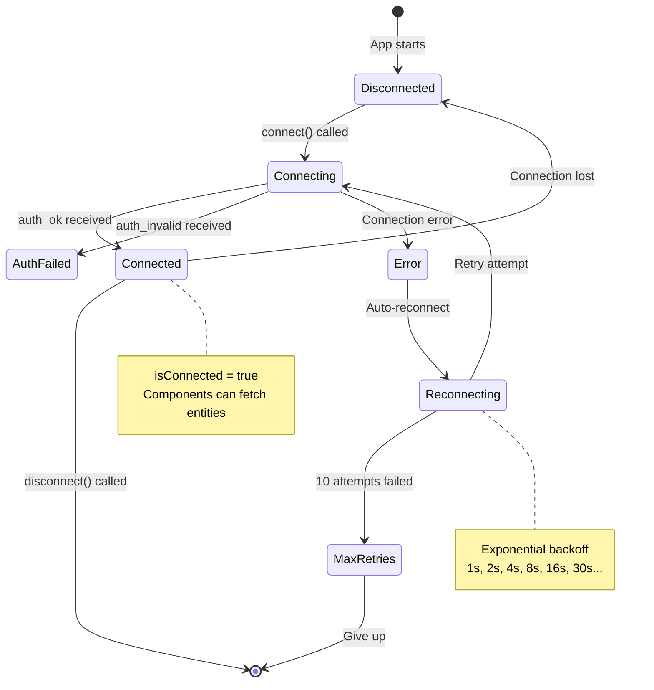

---

## Data Flow: WebSocket Singleton Pattern

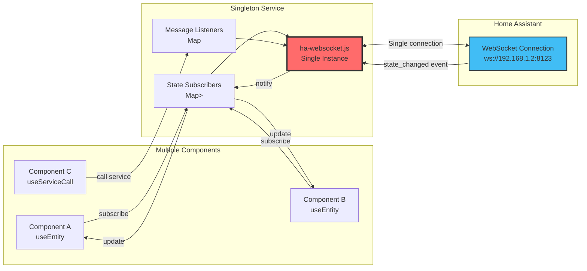

---

## Network Topology

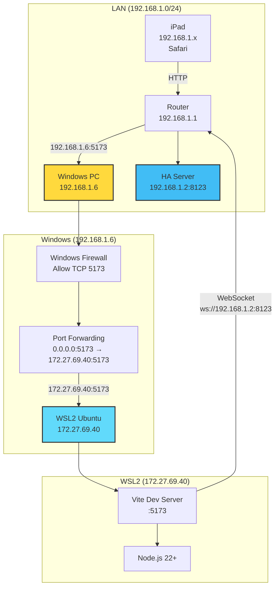

---

## Critical Bug #1: Stale State Issue (FIXED)

**Before Fix:**

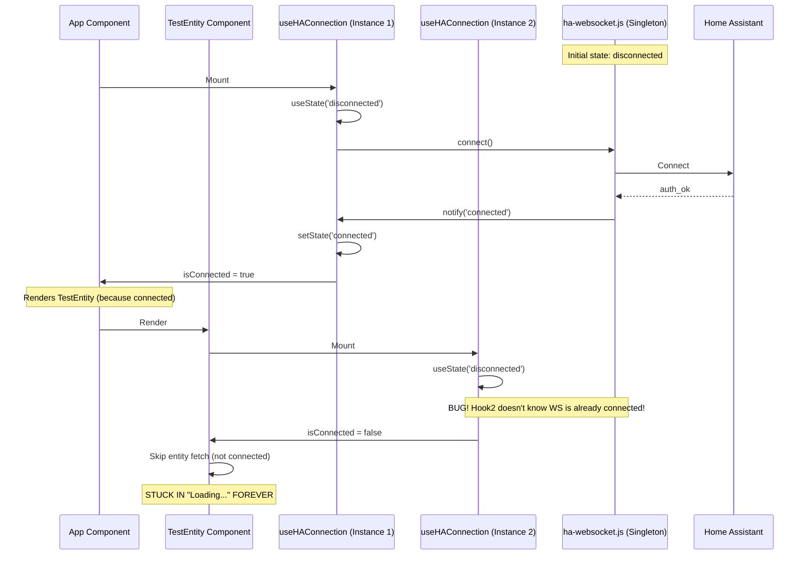

**After Fix:**

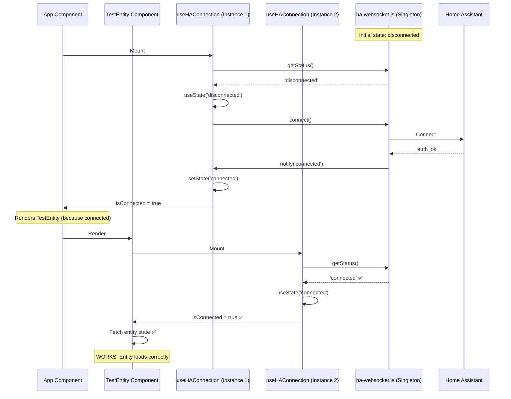

---

## File Dependencies

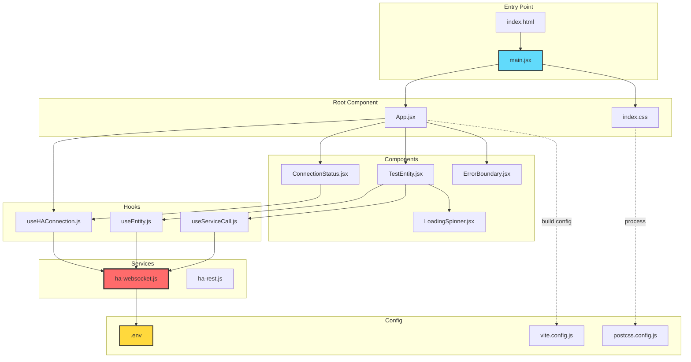

---

## Technology Stack Layers

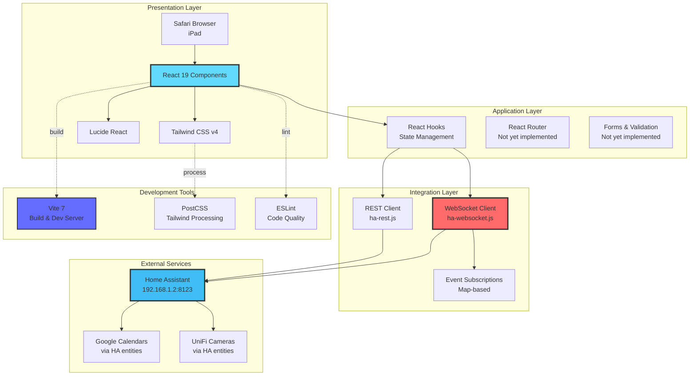

---

**Last Updated:** 2026-01-17 (Phase 1 Complete)

**How to View:**
- **GitHub:** Diagrams render automatically
- **VS Code:** Install "Markdown Preview Mermaid Support" extension
- **Online:** Copy/paste into https://mermaid.live/

**How to Edit:**
- Edit the Mermaid code blocks directly
- Preview changes with Mermaid Live Editor
- Commit and push to see on GitHub
